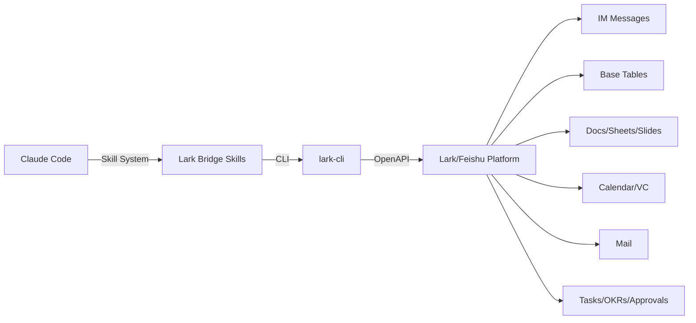

# Claude Code Lark Bridge

<p align="center">
  <b>🔗 Bridge Claude Code to Lark/Feishu — Give your AI Agent 26 enterprise superpowers</b>
</p>

<p align="center">
  
  
  
  
</p>

---

## What is this?

**Claude Code Lark Bridge** is a collection of 26 custom Skills that give Claude Code (and any compatible AI agent) the ability to interact with **Lark/Feishu** — the enterprise collaboration platform used by millions.

Once installed, your AI agent can:
- 📨 Send and read messages in Lark IM
- 📊 Create and manage Base (multi-dimensional tables)
- 📝 Read, write, and edit Docs, Sheets, and Slides
- 📅 Schedule meetings and manage calendars
- 📧 Send and read emails
- ✅ Manage tasks, approvals, and OKRs
- 🎥 Query video conference records and minutes
- 🚀 Deploy HTML apps to Miaoda (飞书妙搭)
- ...and 16 more capabilities

## Architecture



## Available Skills (26 Modules)

| Category | Skill | Capability |
|----------|-------|------------|
| **Communication** | `lark-im` | Send/receive messages, manage group chats |
| | `lark-mail` | Draft, send, reply, forward, search emails |
| | `lark-contact` | Resolve contacts by name/email |
| **Documents** | `lark-doc` | Read & edit Docs/Wiki |
| | `lark-sheets` | Create & manipulate spreadsheets |
| | `lark-slides` | Create & edit presentations |
| | `lark-markdown` | Manage Markdown files |
| | `lark-whiteboard` | Query & edit whiteboards |
| **Data & Storage** | `lark-base` | Multi-dimensional tables, views, dashboards |
| | `lark-drive` | Cloud storage: upload, download, manage files |
| | `lark-wiki` | Knowledge base management |
| **Productivity** | `lark-calendar` | Schedule, search events, book rooms |
| | `lark-task` | Create & track tasks, subtasks |
| | `lark-okr` | Objectives & key results |
| | `lark-approval` | Process approvals |
| | `lark-attendance` | Check attendance records |
| **Meetings** | `lark-vc` | Query meeting history, minutes, transcripts |
| | `lark-vc-agent` | Bot joins/leaves meetings, captures events |
| | `lark-minutes` | Voice-to-text meeting notes |
| **Deployment** | `lark-apps` | Deploy HTML to Miaoda (public URLs) |
| **Automation** | `lark-event` | Real-time event streaming/subscribing |
| | `lark-skill-maker` | Create custom lark-cli Skills |
| | `lark-openapi-explorer` | Discover native OpenAPI endpoints |
| **Workflows** | `lark-workflow-meeting-summary` | Structured meeting reports |
| | `lark-workflow-standup-report` | Daily standup summaries |
| **Setup** | `lark-shared` | Auth, login, identity management |

## Quick Start

### Prerequisites

- **Node.js** ≥ 18
- A Lark/Feishu account
- Claude Code (or any Claude-powered IDE)

### 1. Install lark-cli

```bash
npm install -g @larksuite/cli
```

### 2. Clone & Deploy Skills

```bash
git clone https://github.com/xujie8867/claude-code-lark-bridge.git
cp -r claude-code-lark-bridge/skills/* ~/.claude/skills/
```

### 3. Initialize & Auth

```bash
lark-cli config init --new
```

Scan the QR code to authorize the Lark app.

### 4. Verify

```bash
lark-cli auth status
# Expected: Bot identity: ready
```

### 5. Try It

In Claude Code, just ask naturally:

```
> "Check my recent chat messages"
> "Create a project tracking spreadsheet"
> "Schedule a team meeting for Friday 3pm"
> "Deploy this HTML to Miaoda"
```

The AI automatically detects Lark-related requests and loads the appropriate Skill.

## Identity Modes

| Mode | Identity | Use Case |
|------|----------|----------|
| **Bot** | `--as bot` | App-level operations (default, works out of the box) |
| **User** | `--as user` | Personal account operations (requires `lark-cli auth login`) |

## Windows Setup

```powershell
npm install -g @larksuite/cli
git clone https://github.com/xujie8867/claude-code-lark-bridge.git
xcopy claude-code-lark-bridge\skills\* %USERPROFILE%\.claude\skills\ /E /I
lark-cli config init --new
```

## Real-World Use Cases

- 🏢 **Enterprise automation**: Auto-generate weekly reports from meeting minutes
- 📊 **Data pipelines**: Sync Lark Base data to external systems
- 📧 **Email triage**: AI-powered inbox sorting and drafting
- 🤖 **Chatbot operations**: Manage Lark bots and auto-reply workflows
- 📅 **Smart scheduling**: Find optimal meeting times across teams
- 🚀 **Rapid deployment**: Deploy internal tools to Miaoda in one command

## Project Structure

```
claude-code-lark-bridge/
└── skills/
    ├── lark-im/          # Instant messaging
    │   ├── SKILL.md      # Skill definition & instructions
    │   └── assets/       # Icons, templates
    ├── lark-base/        # Multi-dimensional tables
    ├── lark-doc/         # Documents
    ├── lark-sheets/      # Spreadsheets
    ├── lark-calendar/    # Calendar & meetings
    ├── lark-drive/       # Cloud storage
    ├── lark-mail/        # Email
    │   ├── SKILL.md
    │   ├── references/   # Detailed operation guides
    │   └── assets/       # Email templates
    ├── lark-task/        # Task management
    ├── lark-approval/    # Approvals
    ├── lark-okr/         # Objectives & key results
    ├── lark-wiki/        # Knowledge base
    ├── lark-vc/          # Video conferencing
    ├── lark-vc-agent/    # VC bot agent
    ├── lark-minutes/     # Meeting minutes
    ├── lark-slides/      # Presentations
    ├── lark-markdown/    # Markdown files
    ├── lark-apps/        # Miaoda deployment
    ├── lark-attendance/  # Attendance
    ├── lark-event/       # Event streaming
    ├── lark-openapi-explorer/  # API discovery
    ├── lark-skill-maker/ # Custom skill creation
    ├── lark-whiteboard/  # Whiteboards
    ├── lark-contact/     # Contacts
    ├── lark-shared/      # Auth & setup
    ├── lark-workflow-meeting-summary/  # Meeting reports
    └── lark-workflow-standup-report/   # Standup reports
```

## Ecosystem Impact

Lark/Feishu serves **100M+ users** across Asia-Pacific enterprises. As AI agents become central to enterprise workflows, bridging them to existing collaboration platforms is critical infrastructure. This project fills that gap for the Claude Code ecosystem.

## Roadmap

- [ ] Add CI/CD for skill validation
- [ ] English + Chinese bilingual skill descriptions
- [ ] Web-based skill configurator
- [ ] One-line install script
- [ ] Video tutorials

## Contributing

Contributions welcome! If you'd like to add a new skill or improve an existing one:

1. Fork the repo
2. Create a skill directory under `skills/`
3. Add `SKILL.md` with the skill definition
4. Submit a PR

## License

MIT © 2026 xujie8867 (许海龙)

---

<p align="center">
  <sub>Built with ❤️ for the AI Agent + Enterprise ecosystem</sub>
</p>
